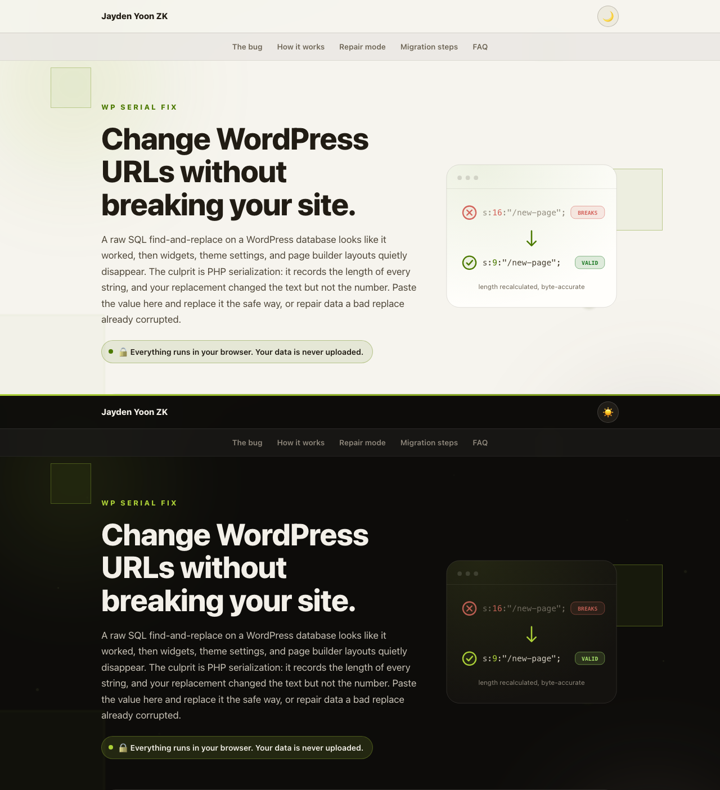

# WP Serial Fix 🧩

Change URLs and domains in WordPress serialized data without breaking it, and repair data a bad SQL replace already corrupted. Runs entirely in your browser.

<p>
  <a href="https://jaydenyoonzk.github.io/wp-serial-fix/"></a>
  <a href="https://github.com/JaydenYoonZK/wp-serial-fix/stargazers"></a>
  <a href="LICENSE"></a>
</p>

<a href="https://jaydenyoonzk.github.io/wp-serial-fix/?demo">
  
</a>

**[Open the live tool](https://jaydenyoonzk.github.io/wp-serial-fix/)** or **[see it fix a sample](https://jaydenyoonzk.github.io/wp-serial-fix/?demo)**. Nothing is uploaded.

## The problem

WordPress stores widget layouts, theme options, and page builder content as PHP serialized strings, where every string carries its exact byte length:

```
s:19:"http://old.example";
```

Move the site and run a database-wide find and replace, and the text changes but the number does not:

```
s:19:"https://new.longer.example";   ← says 19, is actually 26
```

PHP reads 19 bytes, finds no closing quote, and `unserialize()` returns `false`. WordPress treats the option as empty and your settings silently vanish. No error, just a homepage that forgot its widgets. It is the most common way a WordPress migration goes wrong.

## What this does

- **Serialization-safe search and replace**: parses the value, replaces inside the strings, and re-emits with every length prefix recomputed from the real byte length (multibyte and emoji counted correctly). This is what `wp search-replace` does, in your browser, with no database connection.
- **Repair mode**: for data a bad replace already corrupted, it recomputes the wrong length prefixes back to correct, even when the string content itself contains a quote-semicolon.
- **Nested data**: descends into serialized data stored inside other serialized strings, which WordPress does constantly.
- **Objects, arrays, mixed input**: handles `O:` objects (with class name lengths), nested arrays, `R:`/`r:` references and `C:` custom-serialized objects, private and protected object properties, and pasted columns of many values at once, labeling plain text separately.

## Use it

No install: [jaydenyoonzk.github.io/wp-serial-fix](https://jaydenyoonzk.github.io/wp-serial-fix/)

Run locally:

```bash
git clone https://github.com/JaydenYoonZK/wp-serial-fix.git
cd wp-serial-fix
npm run serve   # http://localhost:8401
```

## Use the engine in your own project

`docs/serial.js` is a dependency-free ES module:

```js
import { strictReplace, repair, isSerialized } from "./serial.js";

// safe replace
strictReplace('a:1:{i:0;s:18:"http://old.example";}', "old.example", "new.example.org");

// repair already-broken data
repair('s:19:"https://new-domain.example";').text;   // valid serialized data
```

## Tests

```bash
npm test
```

18 tests cover round-tripping, byte-accurate lengths, multibyte, nested serialization, references and custom-serialized objects, repair with quote-semicolon content, and the plain-vs-serialized detection.

## When to use WP-CLI instead

For a whole live database, `wp search-replace "old" "new"` streams every table and is the right tool. WP Serial Fix is for the common middle ground: a handful of values, one stubborn option, a page builder layout, or a cleanup, without WP-CLI and without pasting production data into a website you do not control.

## License

MIT. Built and maintained by [Jayden Yoon ZK](https://github.com/JaydenYoonZK). Part of a WordPress toolkit with [WP Config Doctor](https://github.com/JaydenYoonZK/wp-config-doctor) and [WP Plugin Checkup](https://github.com/JaydenYoonZK/wp-plugin-checkup).
